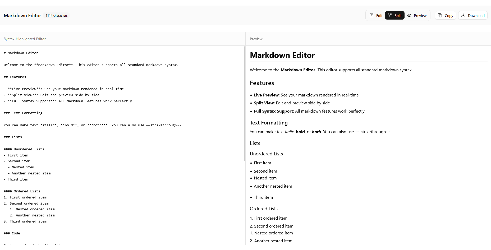

# Markdown Editor React

A modern, feature-rich markdown editor with live preview, syntax highlighting, and multiple view modes built with React and Tailwind CSS.



## ✨ Features

- 🎨 **Syntax Highlighting** - Color-coded markdown syntax in the editor for better readability
- 👁️ **Live Preview** - Real-time rendering of markdown as you type
- 🔄 **Multiple View Modes** - Switch between Edit-only, Preview-only, or Split view
- 📱 **Responsive Design** - Works seamlessly on desktop, tablet, and mobile devices
- 💾 **Export Options** - Copy content to clipboard or download as `.md` file
- 🎯 **Character Counter** - Real-time document length tracking
- 🌙 **Dark Mode Support** - Built-in theme compatibility with system preferences
- 📝 **Rich Markdown Support** - Full support for headers, lists, code blocks, tables, and more
- ⚡ **Fast & Lightweight** - Optimized performance with minimal dependencies

## 🚀 Demo

[Live Demo](https://your-demo-link.vercel.app)

## 🛠️ Tech Stack

- **React 18+** - Modern React with hooks
- **TypeScript** - Type-safe development
- **react-markdown** - Markdown parsing and rendering
- **Tailwind CSS** - Utility-first CSS framework
- **shadcn/ui** - Beautiful and accessible UI components
- **Lucide React** - Clean and consistent icons

## 📦 Installation

1. **Clone the repository**

   ```bash
   git clone https://github.com/atharvdange618/React-Markdown-Editor.git
   cd React-Markdown-Editor
   ```

2. **Install dependencies**

   ```bash
   npm install
   # or
   yarn install
   # or
   pnpm install
   ```

3. **Start the development server**

   ```bash
   npm run dev
   # or
   yarn dev
   # or
   pnpm dev
   ```

4. **Open your browser**
   Navigate to `http://localhost:5173` (or the port shown in your terminal)

## 🎯 Usage

### Basic Usage

```tsx
import MarkdownEditor from "./components/MarkdownEditor";

function App() {
  return (
    <div className="App">
      <MarkdownEditor />
    </div>
  );
}
```

### View Modes

- **Edit Mode**: Focus on writing with syntax highlighting
- **Preview Mode**: See the rendered output
- **Split Mode**: Edit and preview side by side

## 🎨 Customization

The editor uses Tailwind CSS and shadcn/ui components, making it easy to customize:

### Changing Colors

Modify the syntax highlighting colors in the `syntaxHighlight` function:

```tsx
// Headers
.replace(
  /^(#{1,6})\s+(.+)$/gm,
  '<span class="text-blue-600 font-bold">$1</span> <span class="text-purple-700 font-semibold">$2</span>'
)
```

## 📁 Project Structure

```
src/
├── components/
│   ├── ui/              # shadcn/ui components
│   │   ├── badge.tsx
│   │   ├── button.tsx
│   │   ├── card.tsx
│   │   └── separator.tsx
│   └── MarkdownEditor.tsx
├── lib/
│   └── utils.ts
├── App.tsx
└── main.tsx
```

## 🤝 Contributing

Contributions are welcome! Please feel free to submit a Pull Request. For major changes, please open an issue first to discuss what you would like to change.

1. Fork the project
2. Create your feature branch (`git checkout -b feature/AmazingFeature`)
3. Commit your changes (`git commit -m 'Add some AmazingFeature'`)
4. Push to the branch (`git push origin feature/AmazingFeature`)
5. Open a Pull Request

## 🐛 Known Issues

- Some advanced markdown features may not be supported in syntax highlighting

## 📄 License

This project is licensed under the ISC License and is free to use.

## 🙏 Acknowledgments

- [react-markdown](https://github.com/remarkjs/react-markdown) for excellent markdown parsing
- [shadcn/ui](https://ui.shadcn.com/) for beautiful UI components
- [Tailwind CSS](https://tailwindcss.com/) for utility-first styling
- [Lucide](https://lucide.dev/) for clean icons

## 📞 Support

If you have any questions or need help, please:

- Open an issue on GitHub
- Reach out on [Twitter](https://twitter.com/atharvdangedev)
